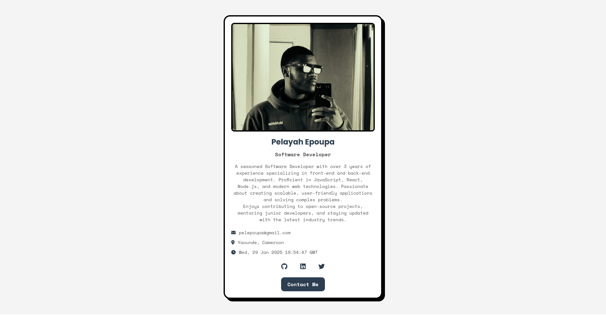
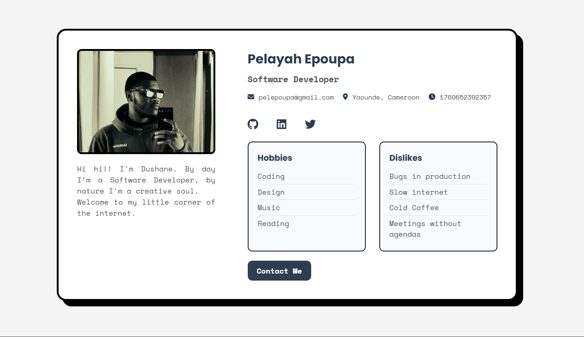

### README.md


# Neobrutalism Profile Card
<!--  -->


A modern and stylish profile card designed in the **Neobrutalism** style. This project features a clean, bold design with interactive elements, animations, and a toast notification system.

## Features

- **Neobrutalism Design**: Bold borders, solid colors, and box-shadow effects.
- **Interactive Elements**: Hover effects, clickable buttons, and a toast notification.
- **Dynamic Content**: Displays the current UTC time.
- **Responsive Design**: Works seamlessly on all screen sizes.
- **Customizable**: Easily update the content, colors, and fonts.

## Technologies Used

- **HTML**: Structure of the profile card.
- **CSS**: Styling and animations.
- **JavaScript**: Dynamic functionality (UTC time, toast notifications).

## Setup Instructions

1. **Clone the Repository**:
   ```bash
   git clone https://github.com/Peliah/neo-brutal-Profile-card.git
   cd neobrutalism-profile-card
   ```

2. **Open the Project**:
   - Open the `index.html` file in your browser.

3. **Customize**:
   - Update the `index.html` file to change the profile information.
   - Modify the `styles.css` file to adjust the design and colors.
   - Edit the `script.js` file to add or modify functionality.

## File Structure

```
neobrutalism-profile-card/
├── index.html          # Main HTML file
├── styles.css          # CSS styles for the profile card
├── script.js           # JavaScript for dynamic functionality
├── README.md           # Project documentation
└── preview.png         # Screenshot of the project
```

## How It Works

- **Profile Card**:
  - Displays the user's name, job title, bio, email, and social links.
  - Shows the current UTC time dynamically.

- **Toast Notification**:
  - When the "Contact Me" button is clicked, a toast notification appears in the bottom-right corner.
  - The toast auto-closes after 3 seconds or can be manually closed.

- **Loading Animation**:
  - A spinning loader appears while the page is loading and fades out once the content is ready.

## Customization

- **Change Colors**:
  - Update the `--accent-color` and other color variables in `styles.css`.

- **Update Content**:
  - Modify the text in `index.html` to reflect your personal or professional details.

- **Add Social Links**:
  - Replace the `#` placeholders in the social links with your actual profile URLs.

## Credits

- **Design & Development**: [Pelayah](https://github.com/Peliah)
- **Fonts**: [Google Fonts](https://fonts.google.com/)
- **Icons**: [FontAwesome](https://fontawesome.com/)

## License

This project is licensed under the MIT License. See the [LICENSE](LICENSE) file for details.

---
